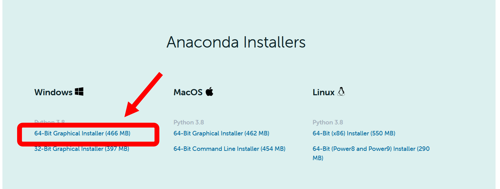
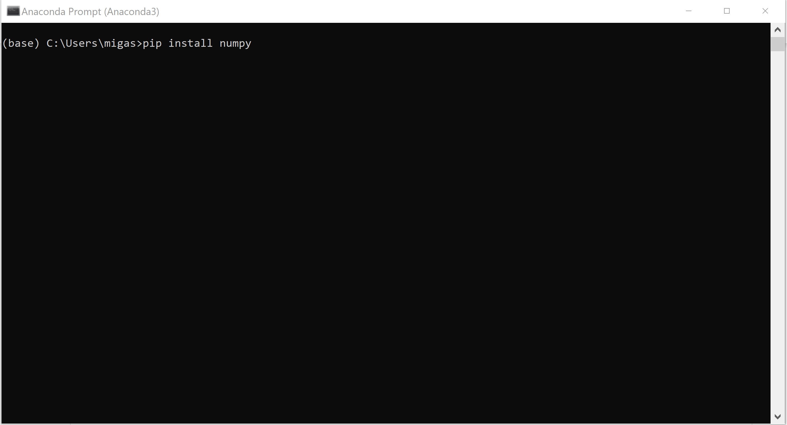

# How to install Python and Biogeme on Windows

1. Begin by installing Anaconda from [here](https://www.anaconda.com/products/individual).
2. Scroll down and download the Anaconda distribution by clicking on Download.

3. Save the file and run it. Install the Anaconda software.
4. Once the installation has completed, we need to install some packages. To do so, begin by running the ‘Anaconda Prompt’ executable, which was installed in step 3.

5. Install the following packages by running the following commands inside the ‘Anaconda Prompt’ (note that some packages may be already installed by default). The image reflects one installation but note that you must install all listed packages.
    1.	numpy: 		`pip install numpy`
    2. matplotlib: 		`pip install matplotlib`
    3. jupyter notebook: 		`pip install jupyter`
    4. biogeme: 		`pip install biogeme`
  

6.	Confirm that biogeme was correctly installed by running the following commands:
    1. `python`
    2. `import biogeme.version as ver`
    3. `print(ver.getText())`

    The output should look like the following image.

    
    
