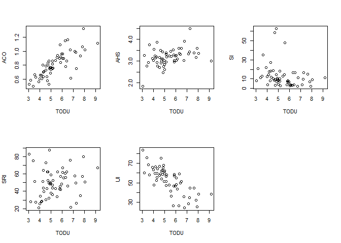
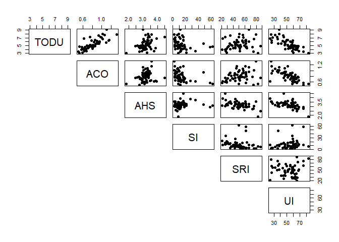
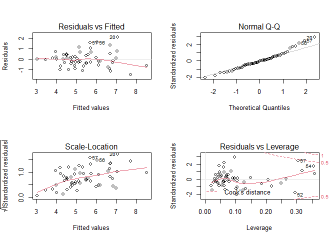

Multiple Linear Regression models
================

#### Example exercise: Trip production of 57 Traffic Assignment Zones of Chicago in 1960’s.

**Your task**: Estimate a linear regression model that predicts trips
per occupied dwelling unit.

#### Variables:

-   `TODU`: Motorized Trips (private car or Public Transportation) per
    occupied dwelling unit;

-   `ACO`: Average car ownership (cars per dwelling);

-   `AHS`: Average household size;

-   `SRI`: Social Rank Index:  
    1. proportion of blue-collar workers (e.g., construction, mining);  
    2. proportion of people with age higher than 25 years that have
    completed at least 8 year of education; (***Note:** The SRI has its
    maximum value when there are no blue-collar workers and all adults
    have education of at least 8 years*)

-   `UI`: Urbanization Index:  
    1. fertility rate, defined as the ratio of children under 5 years of
    age to the female population of childbearing age;  
    2. female labor force participation rate, meaning the % of women who
    are in the labor force;  
    3. % of single family units to total dwelling units.

    The degree of urbanization index would be increased by a) lower
    fertility rate, b) higher female labor force participation rate,
    and c) higher proportion of single dwelling units. (***Note:** High
    values for this index imply less attachment to the home*)

-   `SI`:Segregation Index It measures the proportion of an area to
    which minority groups (e.g: non-whites, foreign-born, Eastern
    Europeans) live in isolation. (***Note:** High values for this index
    imply that those communities are less prone to leaving their living
    areas and as such to having lower levels of mobility*)

## Let’s begin!

##### Import Libraries

``` r
library(readxl) #Library used to import excel files
library(tidyverse) # Pack of most used libraries
library(skimr) # Library used for providing a summary of the data
library(DataExplorer) # Library used in data science to perform exploratory data analysis
library(corrplot) # Library used for correlation plots
library(car) # Library used for testing autocorrelation (Durbin Watson)
library(olsrr) # Library used for testing multicollinearity (VIF, TOL, etc.)
```

##### Import dataset

``` r
dataset <- read_excel("Data/TDM_Class3_MLR_Chicago_Example.xls")
class(dataset)
```

    ## [1] "tbl_df"     "tbl"        "data.frame"

##### Transform the dataset into a dataframe

``` r
df <- data.frame(dataset)
```

##### Show summary statistics

``` r
skim(df)
```

|                                                  |      |
|:-------------------------------------------------|:-----|
| Name                                             | df   |
| Number of rows                                   | 57   |
| Number of columns                                | 6    |
| \_\_\_\_\_\_\_\_\_\_\_\_\_\_\_\_\_\_\_\_\_\_\_   |      |
| Column type frequency:                           |      |
| numeric                                          | 6    |
| \_\_\_\_\_\_\_\_\_\_\_\_\_\_\_\_\_\_\_\_\_\_\_\_ |      |
| Group variables                                  | None |

Data summary

**Variable type: numeric**

| skim\_variable | n\_missing | complete\_rate |  mean |    sd |    p0 |   p25 |   p50 |   p75 |  p100 | hist  |
|:---------------|-----------:|---------------:|------:|------:|------:|------:|------:|------:|------:|:------|
| TODU           |          0 |              1 |  5.37 |  1.33 |  3.02 |  4.54 |  5.10 |  6.13 |  9.14 | ▃▇▅▃▁ |
| ACO            |          0 |              1 |  0.81 |  0.18 |  0.50 |  0.67 |  0.79 |  0.92 |  1.32 | ▆▇▇▃▁ |
| AHS            |          0 |              1 |  3.19 |  0.39 |  1.83 |  3.00 |  3.19 |  3.37 |  4.50 | ▁▂▇▂▁ |
| SI             |          0 |              1 | 13.07 | 12.19 |  2.17 |  6.82 |  9.86 | 15.08 | 62.53 | ▇▂▁▁▁ |
| SRI            |          0 |              1 | 49.56 | 15.84 | 20.89 | 38.14 | 49.37 | 60.85 | 87.38 | ▅▆▇▅▂ |
| UI             |          0 |              1 | 52.62 | 13.46 | 24.08 | 44.80 | 55.51 | 61.09 | 83.66 | ▃▅▇▅▁ |

``` r
summary(df)
```

    ##       TODU            ACO              AHS              SI       
    ##  Min.   :3.020   Min.   :0.5000   Min.   :1.830   Min.   : 2.17  
    ##  1st Qu.:4.540   1st Qu.:0.6700   1st Qu.:3.000   1st Qu.: 6.82  
    ##  Median :5.100   Median :0.7900   Median :3.190   Median : 9.86  
    ##  Mean   :5.373   Mean   :0.8118   Mean   :3.185   Mean   :13.07  
    ##  3rd Qu.:6.130   3rd Qu.:0.9200   3rd Qu.:3.370   3rd Qu.:15.08  
    ##  Max.   :9.140   Max.   :1.3200   Max.   :4.500   Max.   :62.53  
    ##       SRI              UI       
    ##  Min.   :20.89   Min.   :24.08  
    ##  1st Qu.:38.14   1st Qu.:44.80  
    ##  Median :49.37   Median :55.51  
    ##  Mean   :49.56   Mean   :52.62  
    ##  3rd Qu.:60.85   3rd Qu.:61.09  
    ##  Max.   :87.38   Max.   :83.66

## Multiple Linear Regression

Equation with `TODU` as the dependent variable:

*Y*<sub>TODU</sub> = *β*<sub>0</sub> + *β*<sub>1</sub>ACO + *β*<sub>2</sub>AHS + *β*<sub>3</sub>SI + *β*<sub>4</sub>SRI + *β*<sub>5</sub>UI + *ε*

#### Checking assumptions

Before running the model, you need to check if the assumptions are met.

##### Linear relation

For instance, let’s take a look if the independent variables have linear
relation with the dependent variable.

``` r
par(mfrow=c(2,3)) #set plot area as 2 rows and 3 columns
plot(x = df$TODU, y = df$ACO, xlab = "TODU", ylab = "ACO")  
plot(x = df$TODU, y = df$AHS, xlab = "TODU", ylab = "AHS")  
plot(x = df$TODU, y = df$SI, xlab = "TODU", ylab = "SI")  
plot(x = df$TODU, y = df$SRI, xlab = "TODU", ylab = "SRI")  
plot(x = df$TODU, y = df$UI, xlab = "TODU", ylab = "UI")
```

<!-- -->

Or you could execute a pairwise scatterplot matrix, that compares every
variable with each other:

``` r
pairs(df[,1:6], pch = 19, lower.panel = NULL)
```

<!-- -->

> **Note:** SRI and TODU do not have a linear relationship. This should
> interfere on the model.

##### Normal distribution of the dependent variable

Check if the dependent variable is normally distributed. If the sample
is smaller than 2000 observations, use Shapiro-Wilk test:

``` r
shapiro.test(df$TODU)
```

    ## 
    ##  Shapiro-Wilk normality test
    ## 
    ## data:  df$TODU
    ## W = 0.96816, p-value = 0.1377

If not, use the Kolmogorov-Smirnov test

``` r
ks.test(df$TODU, "pnorm", mean=mean(df$TODU), sd = sd(df$TODU))
```

    ## Warning in ks.test(df$TODU, "pnorm", mean = mean(df$TODU), sd = sd(df$TODU)):
    ## ties should not be present for the Kolmogorov-Smirnov test

    ## 
    ##  One-sample Kolmogorov-Smirnov test
    ## 
    ## data:  df$TODU
    ## D = 0.12231, p-value = 0.3612
    ## alternative hypothesis: two-sided

> **Note:** Regarding the warning that appears in the Kolmogorov-Smirnov
> test “ties should not be present for the Kolmogorov-Smirnov test”,
> what most likely happened is that this test is only reliable with
> continuous variables.

Although `TODU` is a continuous variable, the small sample size (n=57)
makes it likely to have repeated values. Consequently, the test
considers `TODU` as a categorical variable. Therefore, this is another
evidence, that for small samples it is more appropriate to use the
Shapiro-Wilk Test.  
The null hypothesis of both tests is that the distribution is normal.
Therefore, for the distribution to be normal, the pvalue &gt; 0.05 and
you should not reject the null hypothesis.

### Multiple linear regression model

``` r
model <- lm(TODU ~ ACO + AHS + SI + SRI + UI, data = df)
summary(model)
```

    ## 
    ## Call:
    ## lm(formula = TODU ~ ACO + AHS + SI + SRI + UI, data = df)
    ## 
    ## Residuals:
    ##     Min      1Q  Median      3Q     Max 
    ## -1.4771 -0.3842 -0.0262  0.4116  2.0806 
    ## 
    ## Coefficients:
    ##              Estimate Std. Error t value Pr(>|t|)    
    ## (Intercept)  2.817367   2.208380   1.276 0.207820    
    ## ACO          3.646707   0.956500   3.813 0.000372 ***
    ## AHS          0.323673   0.412119   0.785 0.435860    
    ## SI           0.005325   0.009279   0.574 0.568550    
    ## SRI          0.008135   0.008804   0.924 0.359783    
    ## UI          -0.036264   0.013330  -2.720 0.008894 ** 
    ## ---
    ## Signif. codes:  0 '***' 0.001 '**' 0.01 '*' 0.05 '.' 0.1 ' ' 1
    ## 
    ## Residual standard error: 0.7554 on 51 degrees of freedom
    ## Multiple R-squared:  0.7042, Adjusted R-squared:  0.6752 
    ## F-statistic: 24.28 on 5 and 51 DF,  p-value: 2.04e-12

**Assessing the model**:

1.  First check the **pvalue** and the **F statistics** of the model to
    see if there is any statistical relation between the dependent
    variable and the independent variables. If pvalue &lt; 0.05 and the
    F statistics &gt; Fcritical = 2,39, then the model is statistically
    acceptable.  
2.  The **R-square** and **Adjusted R-square** evaluate the amount of
    variance that is explained by the model. The difference between one
    and other is that the R-square does not consider the number of
    variables. If you increase the number of variables in the model, the
    R-square will tend to increase which can lead to overfitting. On the
    other hand, the Adjusted R-square adjusts to the number of
    independent variables.  
3.  Take a look at the **t-value** and the Pr(&gt;\|t\|). If the
    t-value &gt; 1,96 or Pr(&gt;\|t\|) &lt; 0,05, then the IV is
    statistically significant to the model.  
4.  To analyze the **estimates** of the variables, you should first
    check the **signal** and evaluate if the independent variable has a
    direct or inverse relationship with the dependent variable. It is
    only possible to evaluate the **magnitude** of the estimate if all
    variables are continuous and standardized or by calculating the
    elasticities. The elasticities are explained and demonstrated in
    chapter 5.

##### Residuals

Let’s see how do the residuals behave by plotting them.

-   **Residuals vs Fitted:** This plot is used to detect non-linearity,
    heteroscedasticity, and outliers.
-   **Normal Q-Q:** The quantile-quantile (Q-Q) plot is used to check if
    the dependent variable follows a normal distribution.
-   **Scale-Location:** This plot is used to verify if the residuals are
    spread equally (homoscedasticity) or not (heteroscedasticity)
    through the sample.
-   **Residuals vs Leverage:** This plot is used to detect the impact of
    the outliers in the model. If the outliers are outside the
    Cook-distance, this may lead to serious problems in the model.

Try analyzing the plots and check if the model meets the assumptions.

``` r
par(mfrow=c(2,2))
plot(model)
```

<!-- -->

##### Autocorrelation

Execute the Durbin-Watson test to evaluate autocorrelation of the
residuals

``` r
durbinWatsonTest(model)
```

    ##  lag Autocorrelation D-W Statistic p-value
    ##    1       0.1416308      1.597747   0.086
    ##  Alternative hypothesis: rho != 0

> **Note:** In the Durbin-Watson test, values of the D-W Statistic vary
> from 0 to 4. If the values are from 1.8 to 2.2 this means that there
> is no autocorrelation in the model.

##### Multicollinearity

Calculate the VIF and TOL to test for multicollinearity.

``` r
ols_vif_tol(model)
```

    ##   Variables Tolerance      VIF
    ## 1       ACO 0.3528890 2.833752
    ## 2       AHS 0.3963709 2.522889
    ## 3        SI 0.7968916 1.254876
    ## 4       SRI 0.5236950 1.909508
    ## 5        UI 0.3165801 3.158758

> **Note:** Values of VIF &gt; 5, indicate multicollinearity problems.

Calculate the Condition Index to test for multicollinearity

``` r
ols_eigen_cindex(model)
```

    ##    Eigenvalue Condition Index    intercept          ACO          AHS
    ## 1 5.386537577        1.000000 6.994331e-05 0.0005136938 0.0001916512
    ## 2 0.444466338        3.481252 6.484243e-05 0.0026682253 0.0001278701
    ## 3 0.084386209        7.989491 5.829055e-05 0.0478676279 0.0091615336
    ## 4 0.073784878        8.544195 1.355679e-03 0.0031699136 0.0100934045
    ## 5 0.009322827       24.037043 5.414145e-03 0.7943557055 0.2105218176
    ## 6 0.001502171       59.881840 9.930371e-01 0.1514248340 0.7699037229
    ##            SI         SRI           UI
    ## 1 0.007888051 0.001515333 6.216297e-04
    ## 2 0.693175876 0.006641788 7.488285e-07
    ## 3 0.051400736 0.055585833 1.128114e-01
    ## 4 0.152292605 0.382488929 4.801705e-02
    ## 5 0.090809203 0.374832118 1.851308e-01
    ## 6 0.004433528 0.178935999 6.534183e-01

> **Note:** Condition index values &gt; 15 indicate multicollinearity
> problems, and values &gt; 30 indicate serious problems of
> multicollinearity.

To test both simultaneously, you can run the code below:

``` r
ols_coll_diag(model)
```
