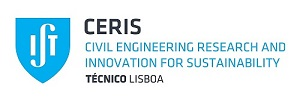

Transport Demand Modelling Course
================

This repository intends to gather, and make available, the supporting materials for the [Transport Demand Modelling course](https://fenix.tecnico.ulisboa.pt/disciplinas/MPTra/2020-2021/1-semestre/materiais-de-apoio), lectured by [Prof. Filipe Moura](https://ushift.tecnico.ulisboa.pt/team-filipe-moura/).  
This material is also an open source tutorial for applying R programming (chapters 1-7 and 9) and Python Biogeme (chapter 8) in transport demand modelling.

## Summary

1.  [Exploratory Data Analysis](1-ExploratoryDataAnalysis.md)

2.  [Multiple Linear Regression models](2-MultipleLinearRegression.md)

3.  [Exploratory Factor Analysis](3-FactorAnalysis.md)

4.  [Cluster Analysis](4-ClusterAnalysis.md)

5.  [Generalized linear models](5-GeneralizedLinearModels.md)

6.  [Spatial regression models](6-SpatialModels.md)

7.  [Panel Data Models](7-PanelModels.md)

8.  [Discrete Choice Models](8-DiscreteChoiceModels.md)
    
      - [Multinomial](Code/8.1-MultinomialLogitAndProbitModels/)
      - [Nested](Code/8.2-NestedLogitModels/)
      - [Ordered Models](Code/8.3-OrderedLogitModels/)

9.  [Hazard-Based Duration Models](9-HazardBasedModels.md)

### Files

  - In the [Data](Data/) folder you may find all the files for the exercises.  
  - The [Code](Code/) folder contains scripts for each topic.
  
#### Slides
You may find all lectures slides in the [course page](https://fenix.tecnico.ulisboa.pt/disciplinas/MPTra/2020-2021/1-semestre/lectures).

  
### R and Python stuff

  - [How to install R and RStudio](0-InstallR.md)
  - Check [some tips](00-RMarkdownReports.md) how to make your home assignments as static or dynamic outputs with *R Markdown*.
  - [How to install Python and Pandas Biogeme](0-Install_PythonBiogeme_win.md)
  
## Acknowledgements:

* [Gabriel Valença](https://ushift.tecnico.ulisboa.pt/team-gabriel-valenca/): preparation of code of Chapters 1-5, 7.
* [Rosa Félix](https://ushift.tecnico.ulisboa.pt/team-rosa-felix/): preparation of code of Chapter 6, "How to install R", "Tips for RMarkdown", revision of code of Chapters 1-7, 9.
* [Miguel Costa](https://ushift.tecnico.ulisboa.pt/team-miguel-costa/): preparation of code of Chapter 8, and "How to install Python".
* [Carlos Roque](https://ushift.tecnico.ulisboa.pt/team-carlos-roque/): preparation of code of Chapter 9.
* [Filipe Moura](https://ushift.tecnico.ulisboa.pt/team-filipe-moura/): supervision.

## Reference

If you use this material, please [cite as](https://github.com/U-Shift/Transport-Demand-Modelling/blob/master/refs.bib):

> Filipe Moura, Gabriel Valença, Miguel Costa, Carlos Roque, & Rosa Félix. (2021, March). U-Shift/Transport-Demand-Modelling: Supporting materials to Transportation Demand Modelling classes at Instituto Superior Técnico - University of Lisbon. (Version 2021.0). GitHub. http://doi.org/10.5281/zenodo.4599525

